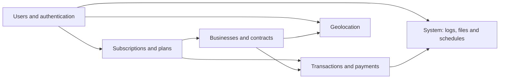

<h1 align="center">Soltura – SQL Server DB</h1>

Design and implementation in **SQL Server** of the database for *Soltura*, a subscription platform with benefits at partner businesses: users buy plans, redeem their benefits with a QR code, and the company settles payments with each business. It includes the 49-table data model, data population, T-SQL demonstrations, security, concurrency tests, and the migration of data from *Payment Assistant* (MySQL). Built for the **Databases I** course (Case #2).

<p align="center">
  
</p>

<p align="center">
  
  
  
  
</p>

---

## Table of Contents
- [Features](#features)
- [Authors](#authors)
- [Database Architecture](#database-architecture)
- [Technology Stack](#technology-stack)
- [Project Structure](#project-structure)
- [How To Run](#how-to-run)
- [Remaining Work](#remaining-work)
- [What I Learned](#what-i-learned)

---

## Features
* **49-table model** with the `Socai` prefix, grouped into six functional areas (users, subscriptions, businesses, payments, geolocation, and system).
* **QR validation:** plan benefits (entries, discounts, balance) are redeemed with a code and recorded as a transaction.
* **Businesses and contracts:** contracts, renewals, taxes, and periodic settlements with each business.
* **Subscriptions** with family plans (members), benefits per plan, and balances per person.
* **Multi-currency payments** with encrypted tokens and a log of everything that happens in the system.
* **T-SQL demonstrations:** local and global cursors, triggers, `SCHEMABINDING`, `WITH ENCRYPTION`, `MERGE`, `UNION`, `EXECUTE AS`, and more.
* **Security:** logins, users, roles and permissions, Row-Level Security, and data encryption with symmetric and asymmetric keys.
* **Advanced queries:** indexed view, nested transactional procedures, JSON output, table-valued parameters, CSV generation, and logging to a linked server.
* **Concurrency:** deadlock scenarios, isolation levels, and a transactions-per-second benchmark.
* **Data migration** from *Payment Assistant* (MySQL) to Soltura (SQL Server) using Python.

---

## Authors
* Christopher Daniel Vargas Villalta, 2024108443
* Adrián Josué Barquero Sánchez, 2024146907
* Santiago Calderón Zúñiga, 2024089232

**Course:** Databases I (*Bases de Datos I*)

**Professor:** Rodrigo Núñez Núñez

| Team member | Part of the project |
|-------------|---------------------|
| Christopher | Data population and T-SQL demonstrations |
| Santiago | Security maintenance and concurrency |
| Barquero | Miscellaneous queries and data migration |

---

## Database Architecture
* **Engine:** SQL Server (database `Caso2`), modeled and managed with SQL Server Management Studio.
* **Naming convention:** every table has the `Socai` prefix, a blend of "Soltura" and "Caipirinha".



| Functional area | Main tables |
|-----------------|-------------|
| Users and authentication | `SocaiUsers`, `SocaiRoles`, `SocaiPermissions`, `SocaiUserRoles`, `SocaiRolePermissions`, `SocaiValidationQr`, `SocaiValidationTypes` |
| Subscriptions and plans | `SocaiSubscriptions`, `SocaiSubscriptionUser`, `SocaiSubscriptionMembers`, `SocaiPlanFeatures`, `SocaiFeaturesSubscriptions`, `SocaiUnitTypes` |
| Businesses and contracts | `SocaiCommerces`, `SocaiContractCommerces`, `SocaiRenewals`, `SocaiContractObligations`, `SocaiCommerceSettlement`, `SocaiCommerceSettlementDetail`, `SocaiCommerceBalance`, `SocaiTaxRates`, `SocaiServiceTypes` |
| Transactions and payments | `SocaiPayments`, `SocaiDataPayments`, `SocaiPaymentMethods`, `SocaiTransactions`, `SocaiCurrencyTypes`, `SocaiCurrencyExchange`, `SocaiBalances`, `SocaiBalancePerPerson` |
| Geolocation | `SocaiCountries`, `SocaiProvinces`, `SocaiCities`, `SocaiAdresses` |
| System | `SocaiLogs`, `SocaiLogTypes`, `SocaiLogSources`, `SocaiLogSeverities`, `SocaiFiles`, `SocaiFileTypes`, `SocaiSchedules`, `SocaiScheduleDetails`, `SocaiSubscriptionSchedules` |


Each table, with its columns and relationships, is described in [`Documentacion.md`](Caso2DB/Documentacion.md). The full physical diagram is in [`DisenoFisico.pdf`](Caso2DB/DisenoFisico.pdf), and the scripts with their explanations are in [`Queries.md`](Caso2DB/Queries.md).

---

## Technology Stack
* **SQL Server 2022** and **SQL Server Management Studio** (T-SQL).
* **Python** (`pandas`, `pyodbc`, `pymysql`, `pymongo`) in a Jupyter notebook for the migration.
* **MySQL** as the source database (*Payment Assistant*).
* **MongoDB**, listed in the documentation and with a connection in the migration notebook.

---

## Project Structure
```text
Caso-2-BDI/
├── Caso2DB/
│   ├── Documentacion.md        # Model, functional areas, and table descriptions
│   ├── Queries.md              # Scripts and explanations: data population, T-SQL, security, queries, concurrency, and migration
│   ├── DisenoFisico.pdf        # Physical diagram (PDF)
│   ├── img/                    # Physical model diagrams
│   ├── ScriptsGenerales/       # Physical model scripts (ModeloFisicoFinal.sql) and earlier versions
│   ├── ScriptsQueries/         # Query scripts, data population, and the migration notebook
│   ├── ScriptsChris/           # Christopher's working scripts
│   ├── ScriptsSanti/           # Santiago's working scripts
│   └── ScriptsBarquero/        # Barquero's working scripts
└── README.md
```

---

## How To Run

### Prerequisites
* SQL Server 2022 and SQL Server Management Studio (the generated scripts use compatibility level 160).
* For the migration: Python 3, Jupyter, a MySQL server with the `paymentAssistant` database, and the libraries imported by the notebook.

### Quick start
1. Create the database in SSMS: `CREATE DATABASE Caso2;`
2. Run `Caso2DB/ScriptsGenerales/ModeloFisicoFinal.sql` to create the 49 tables.
3. Run `Caso2DB/ScriptsQueries/QueryPoblacionDeDatos.sql` to fill the tables with test data.
4. Run the other scripts in `Caso2DB/ScriptsQueries/` depending on what you want to test:
   * `QueryDemostraciones.sql` and `QueryDemostraciones2.sql`: T-SQL demonstrations.
   * `QueryMantenimientoDeSeguridad.sql`: logins, roles, Row-Level Security, and encryption.
   * `ConsultasMiscelaneas.sql`: indexed view and stored procedures.
   * `QueryConcurrencia.sql`: deadlocks and isolation levels (some scenarios need two open sessions).
5. For the migration: create the source database with `creacionBD.sql` and `llenadoMYSQL.sql`, adjust the connections in `migracionBD.ipynb`, and run it.

### Notes
* Some scripts contain hardcoded paths and demo credentials, for example the database file path in `ScriptsGenerales/ScriptsViejos.sql` and the login passwords in `QueryMantenimientoDeSeguridad.sql`. Adjust them to your environment.
* Remote logging (`ConsultasMiscelaneas.sql`) requires setting up a linked server first.
* The scripts in the per-person folders (`ScriptsChris`, `ScriptsSanti`, `ScriptsBarquero`) are working versions; the final ones are in `ScriptsGenerales` and `ScriptsQueries`.

---

## Remaining Work
- [ ] Write each team member's documentation: `DocumentacionB.md`, `DocumentacionC.md`, and `DocumentacionS.md` only contain a title.
- [ ] Fix the `vwResumenUsuarios` view definition in `Queries.md` (section 4.1), which has an extra `;` before the last condition. The `ConsultasMiscelaneas.sql` script is correct.
- [ ] Update the name of the security script in `Queries.md` (section 3), which says `Scripts&Queries Mantenimiento de Seguridad.sql` while the file is named `QueryMantenimientoDeSeguridad.sql`.
- [ ] Consolidate the scripts: there are duplicate or slightly different copies across `ScriptsBarquero`, `ScriptsChris`, `ScriptsSanti`, and `ScriptsQueries`. Keep a single final version, in execution order.
- [ ] Unify naming in the model: the `SocaiAdresses` table is misspelled in the script (and called `SocaiAddresses` in the documentation), and `solturaContractObligations` does not use the `Socai` prefix. `Documentacion.md` also has two sections numbered 4.3.5.
- [ ] Test the full migration end to end with the notebook and record its metrics.
- [ ] Check against the case requirements that every requested query and demonstration is included.


